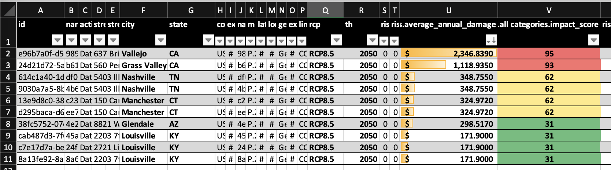

# Getting Started with Moody’s Climate on Demand Pro APIs to Retrieve Financial Metrics for Portfolios
If you own or manage assets, these are some very important questions:
-	How bad is your Hospital’s exposure to climate driven risks, and what losses should you expect from wildfires in the coming years? 
-	Which one of your manufacturing plants is most exposed to flood and sea level rise, and what’s the measure of financial damage going to be like? 
-	Will your farm be under water-stress frequently or flooded by year 2030, and what financial damage do you expect from it? 
For anyone looking to fully understand the risks within an asset portfolio, the potential impacts from current climate risk and climate change are increasingly important element to capture. 

To help assess these risks, [Moody's Climate on Demand](https://climate.moodys.com/climate-on-demand) provides financial loss metrics, as well as impact scores for both climate and climate change-related risks. The data used in the Climate on Demand application helps users to incorporate risk from physical nature-made perils including floods, wildfires, hurricanes and typhoons, and earthquakes as well as chronic climate risks including heat stress, water stress, and sea level rise. Together this data helps users translate physical climate risks into financial impact for a given location and portfolio.


This sample shows how using the Moody's Climate on Demand Pro solution, you can retrieve risk data, such as Average Annual Damage, for a set of locations/addresses in various forms. 

To get started, ensure you set up your env (env_setup.sh for bash users) and run the climate_risk_data_with_cod.py.
The sample uses a small list of random addresses to build a job, then it retrieves climate risk scores, and finally saves the output to a cod_output.csv file.



# Getting Started
Ensure to have pandas, python_loadenv, requests available in your python env (or run env_setup.sh) and ensure to have credentials for Moody's Climate on Demand. Copy sample.env to .env and specify the following settings in the ".env" file. 

```markdown
userID = 'your_CoD_username/email'
password = 'your_CoD_password'
baseURL = 'your_URL_for_CoD' 
tenantName = 'your_CoD_tenant_name' 
```

# Introducing Moody's Climate on Demand
Moody’s Climate on Demand features two distinct editions, a Standard edition, and a newly launched Pro edition. Let’s look at the differences between the two editions: 

•	Climate on Demand Standard Edition delivers basic climate risk scores based on nature-made perils including floods, wildfires, hurricanes and typhoons, and earthquakes as well as chronic climate risks including heat stress, water stress, and sea level rise from today to the year 2100. This edition is ideal for users looking to understand where the risk from climate and climate change is greatest within a portfolio by location, how these risks will change over time with the impact of climate change, and for some climate risk reporting, regulatory filings and so on.

•	Climate on Demand Pro Edition delivers everything in the standard edition and include advanced climate risk impact scores and financial metrics on the same perils/hazards mentioned above. Pro edition report these metrics for risk’s impact today as well as how the impacts will evolve with climate change over time all the way to year 2100, based on Moody’s RMS modeled loss experience. Pro edition of Moody’s Climate on Demand is ideal for users looking to understand financial impact and build derived metrics that quantify risk to asset-value or risk to mortgage-default and so on.

You can read more about how RMS’s science and experience in building models turn into the Climate on Demand Pro metrics [here](https://www.moodysanalytics.com/articles/2023/quantifying-financial-impact-of-climate-risk-with-moodys-climate-on-demand) and [here](https://www.moodysanalytics.com/articles/2023/climate-on-demand-our-vision-for-quantifying-climate-impacts) and find roadmap for Climate on Demand [here](https://www.moodysanalytics.com/articles/2023/moodys-climate-on-demand-version-2-the-road-ahead-for-2023-and-beyond). 

Enjoy.

