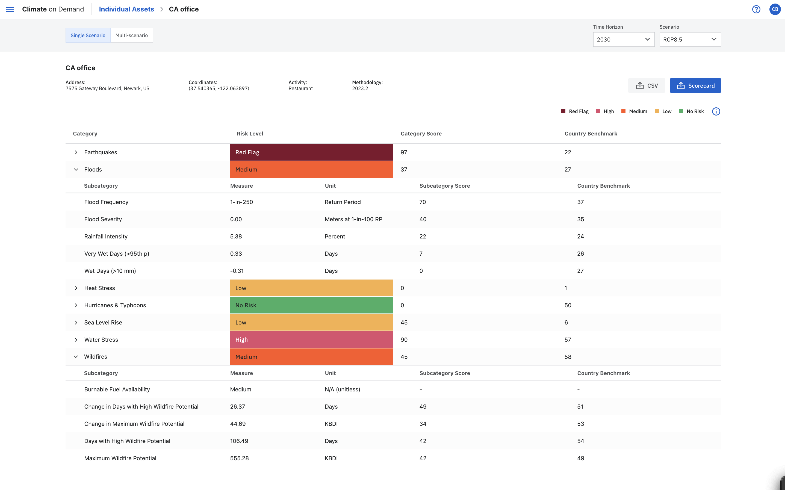

# Analyzing climate risk with Moody's Climate on Demand
Climate and climate change is increasingly an important element to capture for anyone looking to get a full understanding risk on their asset portfolios. Moody's Climate on Demand (https://climate.moodys.com/climate-on-demand) provides financial loss metrics, as well as impact scores for climate and climate change related risks. Climate on Demand data help anyone incorporate risk from nature-made perils including floods, wildfires, wind-storms, earthquakes as well as heat-stress, water-stress and sea-level rise, and help translate physical climate risk into financial impact for a given location and portfolio.



This sample show how using the Moody's Climate on Demand product, one can retrieve data for a set of locations/addresses the associated risk in the form of average-annual-loss for each of the nature-made perils. 

To get started, ensure you set up your env (env_setup.sh for bash users) and run the climate_risk_data_with_cod.py.
The sample uses a small list of random addresses to build a job, then retrieve climate risk scores, and finally  saves the output to a cod_output.csv file.

# Getting Started
Ensure to have pandas, python_loadenv, requests available in your python env (or run env_setup.sh). And ensure to have credentials for Moody's Climate on Demand. Copy sample.env to .env and specify the following settings in the ".env" file. 

```markdown
userID = 'your_CoD_username/email'
password = 'your_CoD_password'
baseURL = 'your_URL_for_CoD' 
tenantName = 'your_CoD_tenant_name' 
```
Introducing Moody's Climate on Demand
Climate on Demand comes with two editions. 
- Climate on Demand Standard Edition provides basic climate risk scores and climate change risk scores all the way to year 2100 based on hazard intensity. This edition is great for anyone looking to understand where climate and climate change risk is greatest in their portfolios. How that will change over time with the impact of climate change for each location and so on.
- Climate on Demand Pro Edition provides advanced climate risk impact scores and financial metrics as well as climate change financial metrics all the way to year 2100 based on loss experience Moody’s RMS has modeled. RMS’s superior science in understanding damage and financial loss comes from its cooperation with the Insurance Industry and 3 decades of historical claims experience that validate how hazards impact assets and how assets vulnerabilities result in financial loss. 

You can read more about how RMS’s science and experience in building models turn into the Climate on Demand Pro metrics here: https://www.moodysanalytics.com/articles/2023/climate-on-demand-our-vision-for-quantifying-climate-impacts and find roadmap for Climate on Demand here: https://www.moodysanalytics.com/articles/2023/moodys-climate-on-demand-version-2-the-road-ahead-for-2023-and-beyond 


Enjoy.

